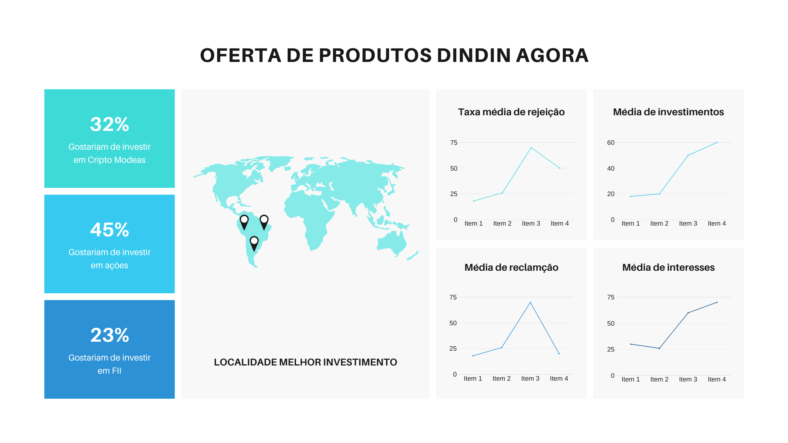

# Justificativa

Escolhemos o MongoDB juntamente com o Python utilizando as tecnologias:

- Panda
- Matplotlib
- NumPy

Utilizaremos as tecnologias mencionadas anteriormente para realizar as análise exploratória de dados e assim realizar o cruzamento das informações solicitadas pelos executivos da DindinAgora, ou seja, iremos obter todos os dados do MongoDB e então ajustar para enviar para o nosso hadoop e uma vez feito isso termos os dados limpos e no final montaremos nossa machine learning com os dados limpos utilizando o:

- scikit-learn

E para que os executivos da DindinAgora possam acessar os dados na web, decididmos colocar o resultado final na WEB utilizando o FrameWork:

- Flask

Onde o resultado final para os executivos seriam um board igual a este:

