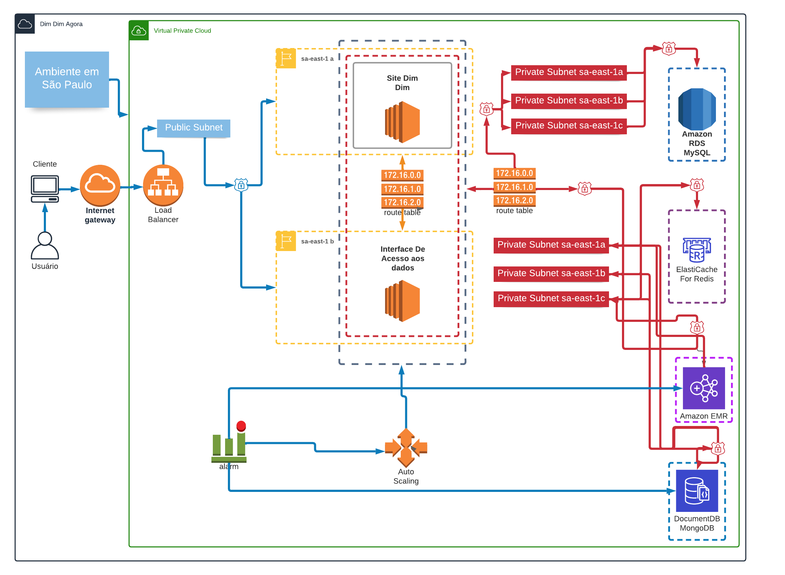

# Desenho final

[](../projeto_final.png)

# Justificativa

Escolhemos utilizar o MongoDB porque é um banco de dados orientado a documentos de alta performance, outro fator é que o banco de dados é open source e schema-free, esrito em C++.

Após muito estudar verificamos que muitos falam de NoSql e do MongoDB, mas porque nós deveríamos usar no Dim Dim?

MongoDB é um banco NoSQL baseado em documento sem trações e preferencialmente sem joins. Ao testarmos ele em nosso projeto chegou-se a conclusão de que o resultado que se tem são consultas muito simples. Elas são mais fáceis de escrever. Elas são mais fáceis também de ajustar. Deixam os desenvolvedores fazerem seu trabalho mais facilmente.

Em nosso estudo onde “produtos” possuem “tipos de investimentos”, existe um documento para cada um, com um investimento no documento de produtos. Vamos dizer que eu quero todos os tipos de investimentos que estão amarrados a um produto da Dim Dim.

Em um banco de dados SQL padrão, tenho duas tabelas: investimentos e produtos. Eu poderia escrever esta consulta da seguinte forma:

```sql

SELECT * from `produtos` INNER JOIN `tiposInvestimentos` ON `tiposInvestimentos`.`produto_id` = ` produtos`.`id`;

```

Analogamente, em um banco de dados MongoDB, digamos que eu tenha apenas uma coleção: produtos. Cada documento de produto tem um atributo chamado “tipos_de_investimentos”, que é uma lista de documentos incorporados. Parece algo como isto em JSON:

```json

{
  nome : Produto da Dim Dim,
  data: 20/07/2022,
  tipos_de_investimentos: [
    {investimento: CDB},
    {investimento: Ações},
    {investimento: Fundo Imobiliário, liquidez : diária}
]}

```

Ao analisar como o MongoDB trabalha com os documentos podemos dizer que é a melhor solução para resolver o nosso problema de performance para obtenção das microanálises de produtos junto as suas descrições e com isso melhorar a performance do nosso produto.
