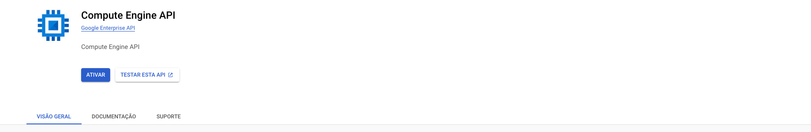
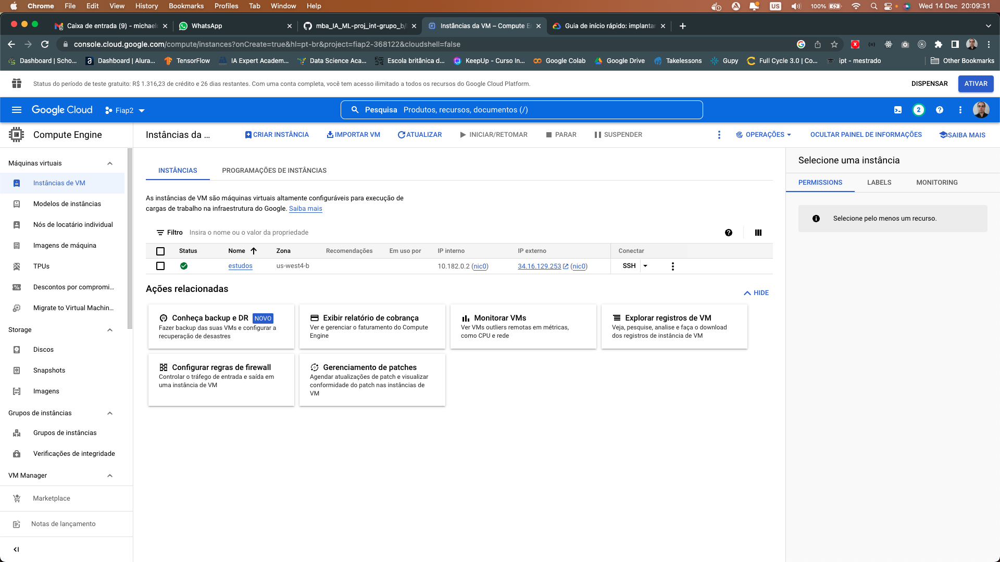
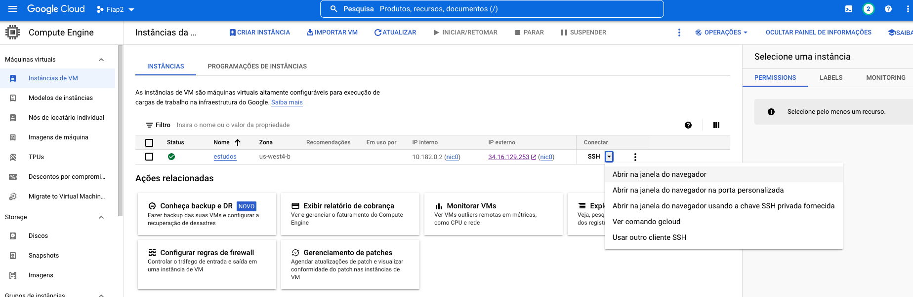
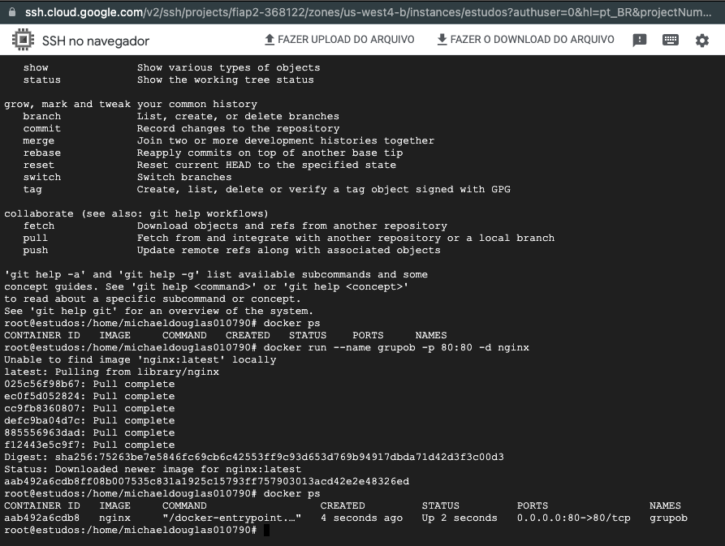
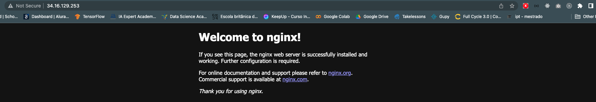
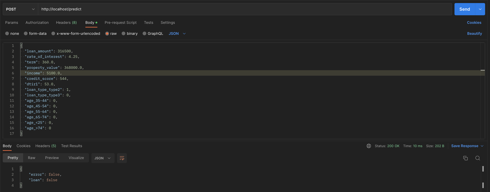

# Ambiente de desenvolvimento

Para testar o ambiente local escolhemos utilizar o Docker Compose. Para executar basta em seu terminal inserir a seguinte instrução:

```bash
docker-compose up -d
```

Para verificar o funcionamento do container execute:

```bash
docker ps
```

E então abrir a API: http://localhost


# Para criar a máquina no GPC

Execute os itens a seguir:

Caso não esteja ativo o Compute Engine API ative ele em sua conta:



Crie então uma instância para subir a API:



Agora devemos abrir o SSH do ambiente para realizar a instalação do Docker e subir a API:



Então irá abrir uma guia com o SSH da máquina:



## Instalação do Docker na máquina

Instalar o docker na máquina com o comando

```bash
apt install docker.io
```

Para verificar a instalação do docker execute no terminal

```bash
docker ps
```

Agora criaremos um container nginx para testar o ambiente:

Confirme se você encontra-se no caminho: /root/mba_IA_ML-proj_int-grupo_b/PlataformasCognitivas/FlaskGoogleDocker

```bash
docker build --tag grupob .
docker run --name grupob -p 80:80 -d grupob
```

Pegue o ip local da máquina e acesse no navegador. Se tudo estiver correto você verá:




Caso você consiga acessar o ambiente normalmente podemos então parar e deletar o ambiente da seguinte maneira:

```bash
docker stop $(docker ps -a -q) && docker rm $(docker ps -a -q)
```

Para verificar a parada do container execute:

```bash
docker ps
```

## Clonando o ambiente do flask

Para realizar o clone é necessário logar no GitHub por prefência escolhemos utilizar o Github cli

Para instalar execute o comando

```bash
apt install gh
```

Para logar em sua conta execute:

```bash
gh auth login
```

Será questionado algumas opções como sugestão deixe da seguinte maneira:

What account do you want to log into? - GitHub.com
What is your preferred protocol for Git operations? - HTTPS
Authenticate Git with your GitHub credentials? - Yes
How would you like to authenticate GitHub CLI? - Login with a web browser

Como estamos em um terminal não irá abrir o navegador automaticamente sendo assim copiei a url:

https://github.com/login/device

E então digite o código que é exibido no terminal:

First copy your one-time code: O CODIGO QUE DEVE SER DIGITADO NO NAVEGADOR

Após isso será informa que já podemos utilizar o git:

 - Authentication complete.


### Clone do ambiente

Agora execute os comandos

```bash
gh repo clone michaeldouglas/mba_IA_ML-proj_int-grupo_b
```

Na sequência:

```bash
cd mba_IA_ML-proj_int-grupo_b/PlataformasCognitivas/FlaskGoogleDocker/
```
### Build da imagem do docker e execução

Para criar a imagem da API Flask execute no terminal:

```bash
docker build --tag grupob .
```

E na sequência para rodar a API execute:

```bash
docker run -d -p 80:80 grupob
```

Caso tudo esteja correto você terá como retorno

```
CONTAINER ID   IMAGE     COMMAND                  CREATED          STATUS          PORTS                NAMES
7b50f09e703d   grupob    "/bin/sh -c 'exec gu…"   17 seconds ago   Up 16 seconds   0.0.0.0:80->80/tcp   hopeful_bell
```

### Executando a API no Postman

Obtenha o IP da instância e chame o teste da seguinte maneira:



Caso tudo esteja correto você terá como retorno:

```json
{
    "error": false,
    "loan": false
}
```

Os arquivos de exemplo para chamada da API:

 - [inadimplente.json](https://github.com/michaeldouglas/mba_IA_ML-proj_int-grupo_b/blob/main/PlataformasCognitivas/FlaskGoogleDocker/src/files/inadimplente.json)
 - [nao_inadimplente](https://github.com/michaeldouglas/mba_IA_ML-proj_int-grupo_b/blob/main/PlataformasCognitivas/FlaskGoogleDocker/src/files/nao_inadimplente.json)