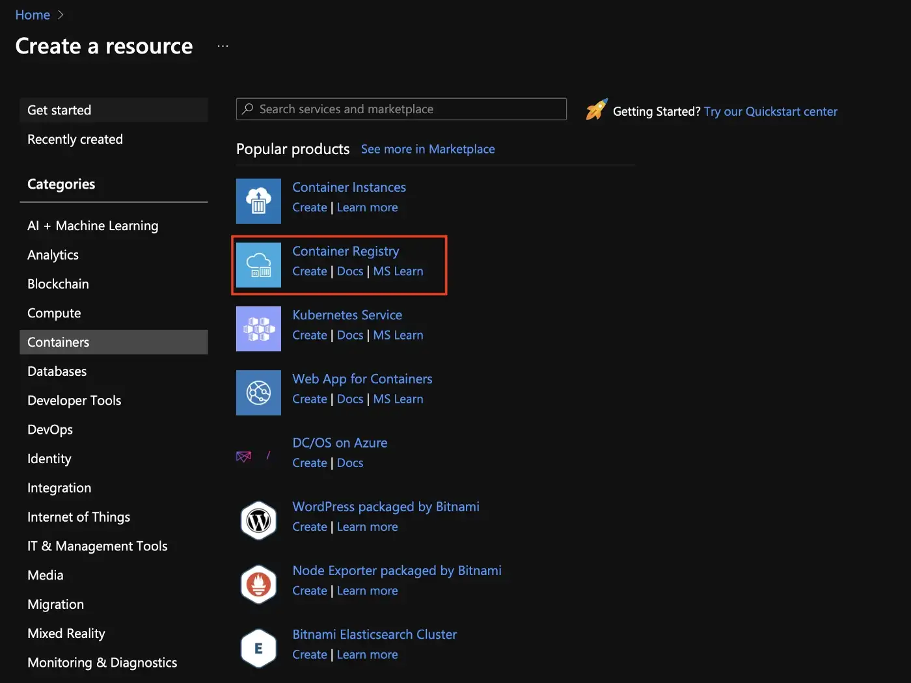

## Subindo o container no Azure

Inicialmente devemos entrar no link: https://portal.azure.com/#allservices e então 
clicar em containers e na sequência escolher a opção **Registros de contêiner**

