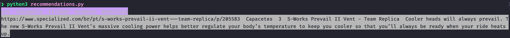

### Sistema de recomendações

Nosso sistema de recomendação obtém os dados da tabela no DynamoDB e então realiza um filtro para ver o total clicado naquele produto e na sequência executa o algoritmo em nossos dados e traz os produtos recomendados, em nossa função existe um parâmetro que permite controlar o total de de recomendações que desejamos exibir.

Exemplo de chamada do nosso algoritmo:

