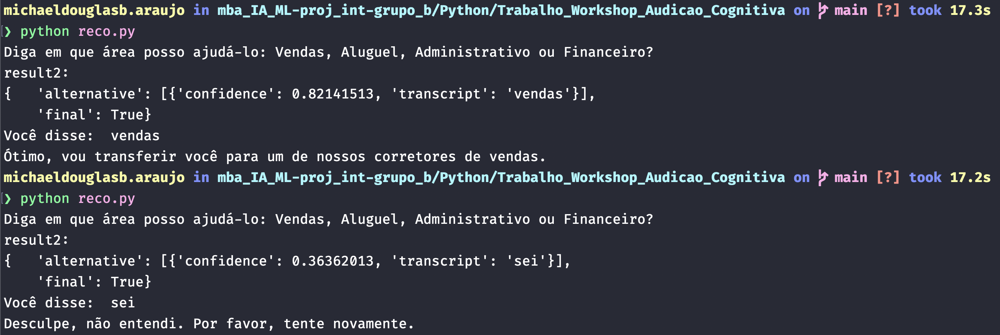

### Trabalho Workshop Audição Cognitiva 

Gerar um texto, em português, como se fosse um atendente virtual de uma imobiliária.

Através da sintetização do texto, a AV precisa dizer ao cliente que está “ligando” o que ele pode pedir. 

São quatro áreas obrigatórias:
Vendas
Aluguel
Administrativo
Financeiro

Com o microfone, a pessoa responde uma dessas áreas e através de alguma das funções de reconhecimento de áudio, a área deverá ser identificada e, novamente por sintetização de voz, deverá gerar um áudio indicando que a ligação será transferida para a área correspondente. Por exemplo: “Ótimo, vou transferir você para um de nossos corretores de vendas.”

Deve estar em um loop. E deve haver uma palavra chave pra encerrar o loop.

## Instalação

Para instalar execute:

```python
pip install -r requirements.txt
```

Caso você tenha problema verifique a lib de áudio do sistema operacional para o nosso caso como era o Mac foi instalado via brew o `portauadio`

```bash
brew install portaudio
```

### Video de exemplo

Vídeo de exemplo da aplicação


[](https://youtu.be/MakxptTReBk)